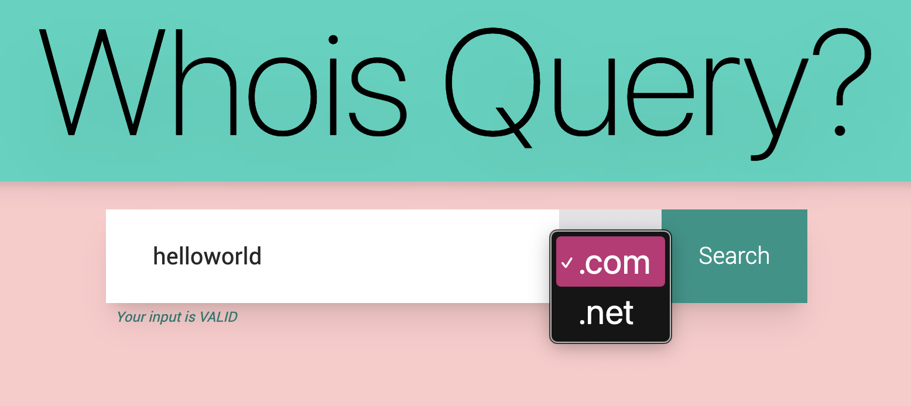
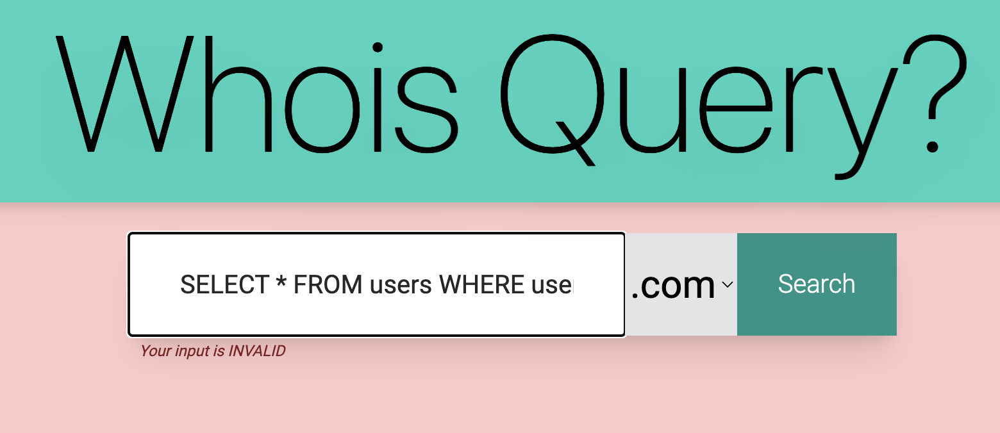
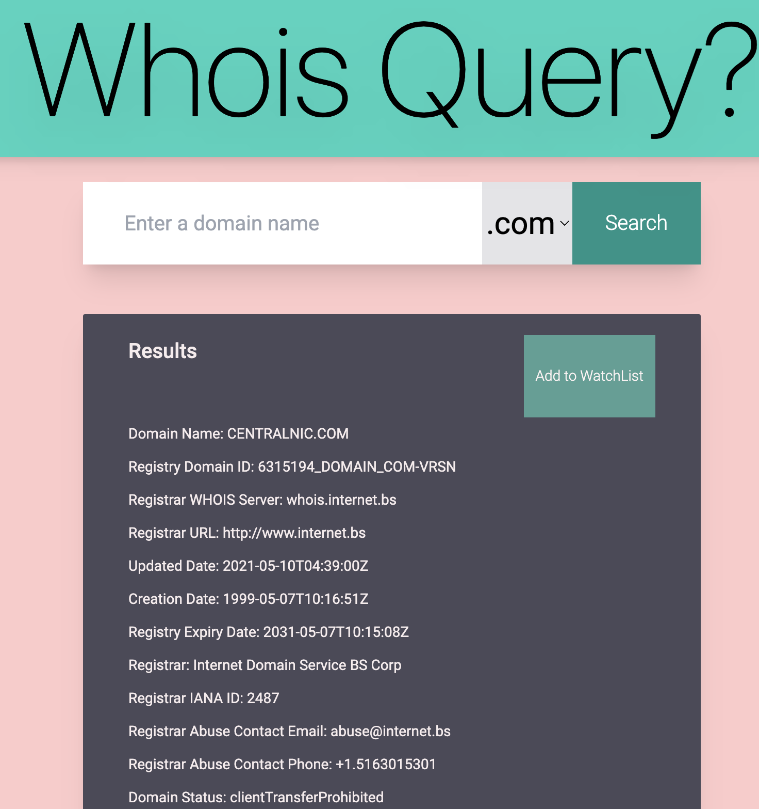
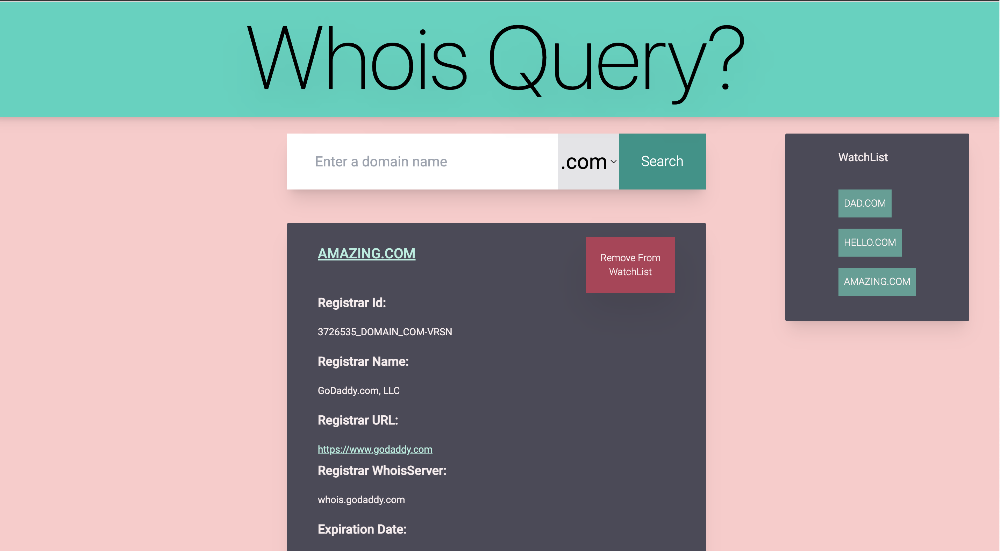

# WhoisQuery Fe



Repository for the front-end of a WhoisQuery Application developed with Angular.

## State Management

To make the app truly reactive and ready to be manageable at scale, we opted to manage state with **NgRx** and recreate Redux-like Patterns to establish a single source of truth to manage the interactions on the client-side.

 🗃 STORE  
|___ state  
|___ actions  
|___ reducers  
|___ effects  
|___ selectors


## Modularity and Composability 
We procured to keep the code modular, the functions pure and keep side effects to the bare minimum. 

Example given, instead of chaining multiple actions within an effect, we opted to draft highly targeted action collections, with a tight scope of execution, that can be atomically actionable and dispatchable as needed from the UI.

- Domain Actions - for API interactions
- UI Actions - for User Interface / User Experience interactions and affordances (e.g: display/hide results, provide validation feedback on user input, etc.)
- WatchList (for additional Ui filtering and scope management)


## Tailwind
For styling our UI, we opted for TailwindCSS, not only for allowing for fast prototyping, but also for the optimized CSS builds, which are significantly smaller than regular CSS.

## Security

### Client-side input sanitization



Although the core of the data validation strategy occurs on the server-side, we still implemented client-side validation on Reactive Forms and disable submission when forbidden characters or missing fields are missing.

Naturally, this doesn't prevent curl / Man-in-the-middle attacks, but for that, we have server-side validation.

  

### Credential and Personally Identifiable Information (PII)

Although we are not dealing with highly-sensitive information (such as passwords, credit card details, etc), we procured to prevent browser caching of user inputs by setting HTML attributes to override the default configuration.
```
    <input formControlName="sldInput" class="w-3/4 h-20 text-xl p-10" type="text" placeholder="Enter a domain name" type="text" min-length="1" maxlength="63" spellcheck="false" autocomplete="off" autocorrect="off" autocapitalize="off">>
```

## Deployment

Backend: Heroku 

Front-End: Vercel


## Roadmap
As further steps, I would refine the following steps: 
  
📌 Implement JWT   
📌 Narrow whitelisted Allowed CORS Requests and establish Same-site policies  
📌 Strict the scope of Headers for the Get Requests (considering that's currently the only interaction with the backend)  
📌 Expand ErrorBoundaries and Pending / Loading responses  
📌 Expand Test suite  
📌 Responsive Design: Elaborate on media queries for adaptive breakpoint layouts.  
📌 Further CRUD operations for data persistance of the user's watchlist options.

## Other considerations
Currently the API request is returning a raw response, which corresponds to an interface IDomainResult that is used for the first load.

Once the user adds a domain to the WatchList, once he clicks it, the response is than parsed to a "prettified" version with a selection of relevant fields from the Whois Query.



If I would get back to it, I would opt for mapping the response to an Interface on the server-side and return it afterwards.


This project was generated with [Angular CLI](https://github.com/angular/angular-cli) version 14.2.2.

## Development server

Run `ng serve` for a dev server. Navigate to `http://localhost:4200/`. The application will automatically reload if you change any of the source files.

## Code scaffolding

Run `ng generate component component-name` to generate a new component. You can also use `ng generate directive|pipe|service|class|guard|interface|enum|module`.

## Build

Run `ng build` to build the project. The build artifacts will be stored in the `dist/` directory.

## Running unit tests

Run `ng test` to execute the unit tests via [Karma](https://karma-runner.github.io).

## Running end-to-end tests

Run `ng e2e` to execute the end-to-end tests via a platform of your choice. To use this command, you need to first add a package that implements end-to-end testing capabilities.

## Further help

To get more help on the Angular CLI use `ng help` or go check out the [Angular CLI Overview and Command Reference](https://angular.io/cli) page.
